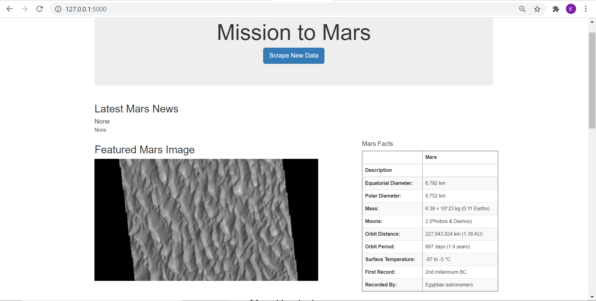
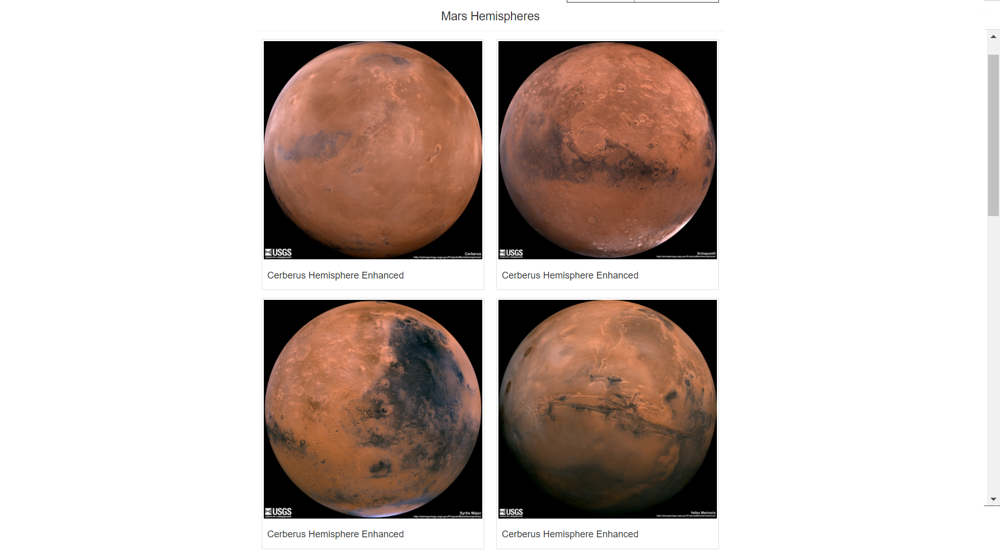

# Mission-to-Mars

A web scraping project to prepare a web app which helps in scraping news and details about Mars. The web app scrapes data from mulitple website like Nasa's website, astrogeology.usgs.gov page, space-facts.com website to find out most recent news and details about Mars. 

Preview of the web app is as below:

